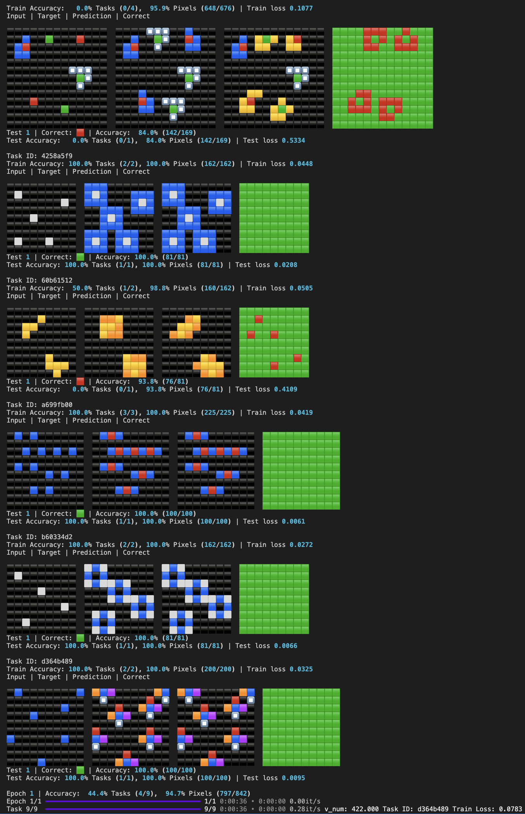

# Solving ARC with Neural Net
> [Abstraction and Reasoning Challenge Competition](https://www.kaggle.com/competitions/arc-prize-2024/data
)

## Output


## Main Libraries
- [Pytorch](https://pytorch.org/tutorials/) (Machine Learning Framework)
- [Pytorch Lightning](https://lightning.ai/docs/pytorch/stable/) (Lightweight PyTorch wrapper)
- [Hydra](https://hydra.cc/docs/intro/) (Configuration Manager)
- [Rich](https://github.com/Textualize/rich) (Formatting)

---

# 1. Setup

```zsh
conda env create -f environment.yml -n myenv
conda activate myenv
```

# 2. Download ARC Data

> To use Kaggle API, place [kaggle.json](https://github.com/Kaggle/kaggle-api/blob/main/docs/README.md#api-credentials) in the locatioin appropriate for your operating system  first to your environment

```zsh
mkdir data
cd data
kaggle competitions download -c arc-prize-2024
unzip arc-prize-2024.zip -d arc-prize-2024
```

# 3. Run
```
src/data.py 
```
- Define Dataset, Dataloader, Datamodule (Pytorch Lighting)
- Run: Visualize all data

```
src/classify.py
```
- Filter data to train or test
- Run: Visualize filtered data

```
src/arc/model/*
```
- Define Model

```
config/*
```
- Set Hyperparameters for train, test

```
src/train.py
```
- Run: Train model

```
src/test.py
```
- Run: Test model trained
