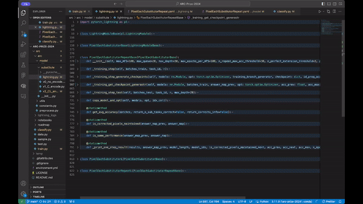

# ARC with Neural Network

> Abstraction and Reasoning Challenge

- [Kaggle Competition - ARC Prize 2024](https://www.kaggle.com/competitions/arc-prize-2024/data
)
- [arcprize.org](https://arcprize.org/)

## Output
> [PixelEachSubstitutor](https://raw.githubusercontent.com/star14ms/ARC-with-Neural-Network/update-readme/output/images/PixelEachSubstitutor.3_depth.gv.png)


> Accuracy First Search (with recurrsion of [PixelEachSubstitutor](https://raw.githubusercontent.com/star14ms/ARC-with-Neural-Network/update-readme/output/images/PixelEachSubstitutor.3_depth.gv.png)
)



## Main Libraries
- [Pytorch](https://pytorch.org/tutorials/) (Machine Learning Framework)
- [Pytorch Lightning](https://lightning.ai/docs/pytorch/stable/) (Lightweight PyTorch Wrapper)
- [Hydra](https://hydra.cc/docs/intro/) (Configuration Manager)
- [Rich](https://github.com/Textualize/rich) (Formatting)

---

# 1. Setup

```zsh
conda env create -f environment.yml -n myenv
conda activate myenv
```

# 2. Download ARC Data

> To use Kaggle API, place [kaggle.json](https://github.com/Kaggle/kaggle-api/blob/main/docs/README.md#api-credentials) in the location appropriate for your operating system

```zsh
mkdir data
cd data
kaggle competitions download -c arc-prize-2024
unzip arc-prize-2024.zip -d arc-prize-2024
```

# 3. Run
```zsh
src/data.py 
```
- Define Dataset, Dataloader, Datamodule (Pytorch Lighting)
- Run: Visualize all data

```zsh
src/classify.py
```
- Filter data to train or test
- Run: Visualize filtered data

```zsh
src/arc/model/*
```
- Define Model

```zsh
config/*
```
- Set Hyperparameters for train, test

```zsh
src/train.py
```
- Run: Train model

```zsh
src/test.py
```
- Run: Test model trained
